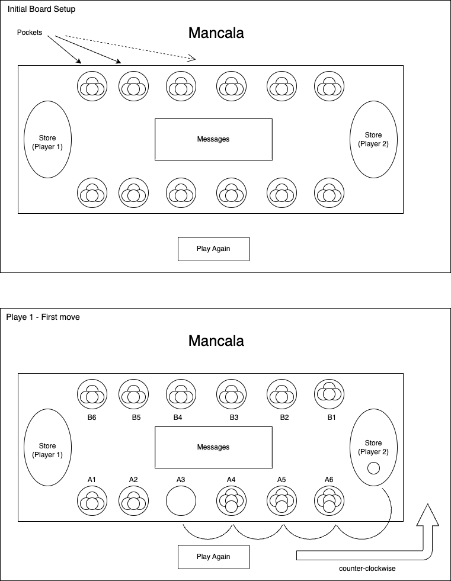

# Planning for Mancala

## Analyze the app's functionality

MVP

As a uer....

- I want to be able to have 2 players
- I want to be able to take turns
- I want to alternate ...
- I want to have 24 stone on my side when the game starts (4 stones in each pocket) where my oponent has 24 stones either
- I want to be able to win if all six pockets on one side are empty and I have the most stones in my store
- I want to know who won
- I want to be able to play again after the game is over


Plans to improve this game in the future:
- Add capturing feature
- Add audio
- Add graphics


- clean/minimalists
- Font Raleway


```html
<link rel="preconnect" href="https://fonts.googleapis.com">
<link rel="preconnect" href="https://fonts.gstatic.com" crossorigin>
<link href="https://fonts.googleapis.com/css2?family=Raleway:wght@100&display=swap" rel="stylesheet">
```

```CSS
font-family: 'Raleway' , sans-serif;
```

## Wireframes the UI

- High Fidelity
    - Buttons are clickable
    - hover effects happen on those buttons
    
- Low Fidelity
    - The app has one page
    - The name of the game (Mancala) shows up on top of the page
    - Messages to the user go in the middle of the board game
    - Play again button goes on the bottom of the page
    - Drawing and visual layout of the page (below are "initial board setup" and "board representation after a first move.)

    
    

## Pseudocode

1) Define required constants
    1.1) None (pockets are going to show the number of stones, no pictures)

2) Define required variables used to track the state of the game
    2.1) Game board - An array with 2 nested arrays(7 indices each) 
    2.2) turn - 1 || -1
    2.3) winner var - null || 1 || -1

3) Cache DOM elements

    3.1) Message place
    3.2) Play again button
    3.3) Game board

4) Upon loading the app should:
    4.1) Initialize the state variables
      - turn var should be set to 1 (player 1 turn)
      - Winner var should be null
      - Create the array of 2 arrays with 7 indices each
    4.2) Render those values to the page
      - Render the board (each array should have all indices with value of 4 except the last index that has a value of 0 representing the store)
    4.3) Wait for the user to interact
    
5) Handle a player clicking a pocket button
    5.1) Update board arrays with player move
    5.2) update the turn var
    5.3) check for a winner
    5.4) Re-render the board with the player move

6) Handle a player clicking the replay button
    6.1) Reset the state vars
    6.2) Render the board

7) Check for a winner
    7.1) Check for a list inside the board array that has first six indices as zeors
    7.2) Check which store has the most stones by comparing the values of last indices of each list in board array
    

## Identify the application's state (data)

 Game board - ...

```js
let board
```
- Turn var - undefined || 1 || -1
```js
let turn
```
- Winner var - null || 1 || -1
```js
let winner
```

